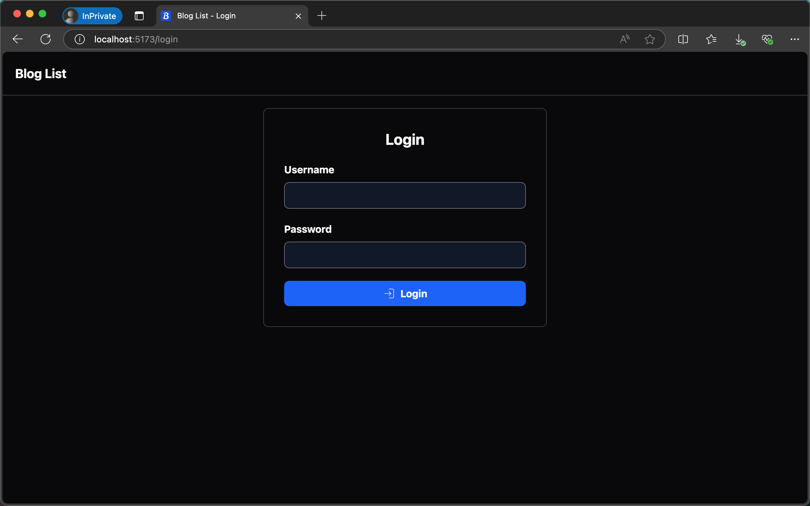
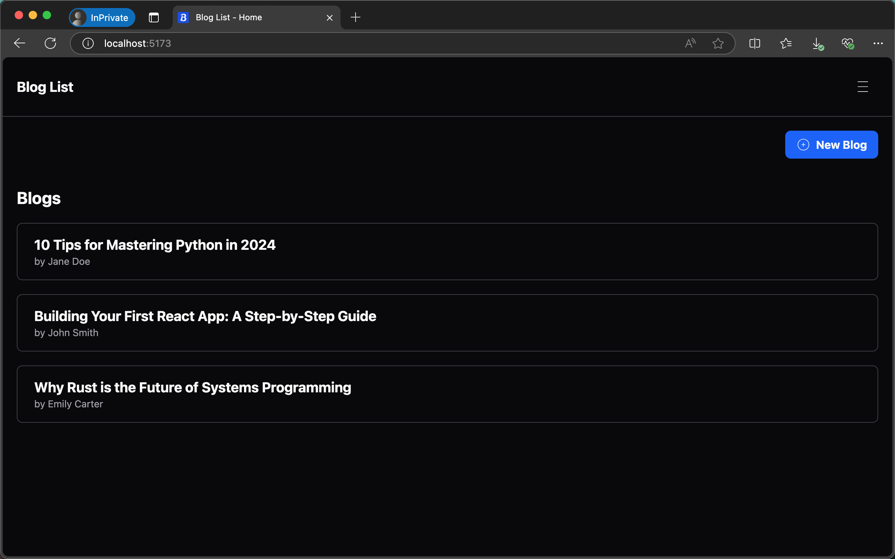
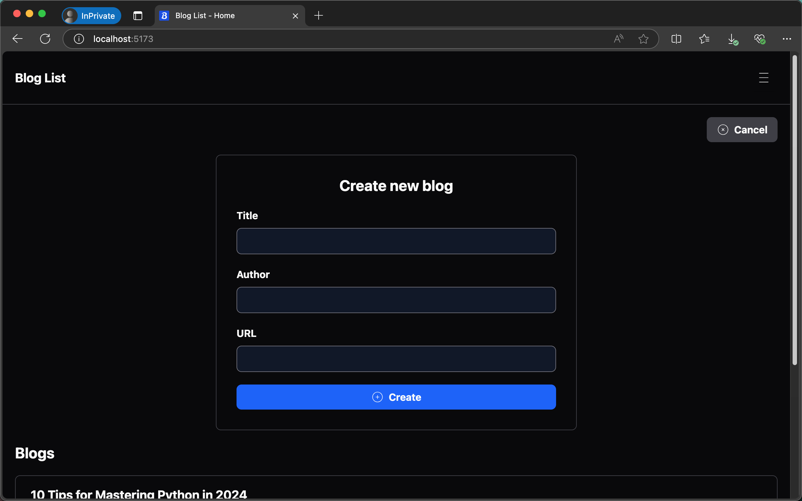
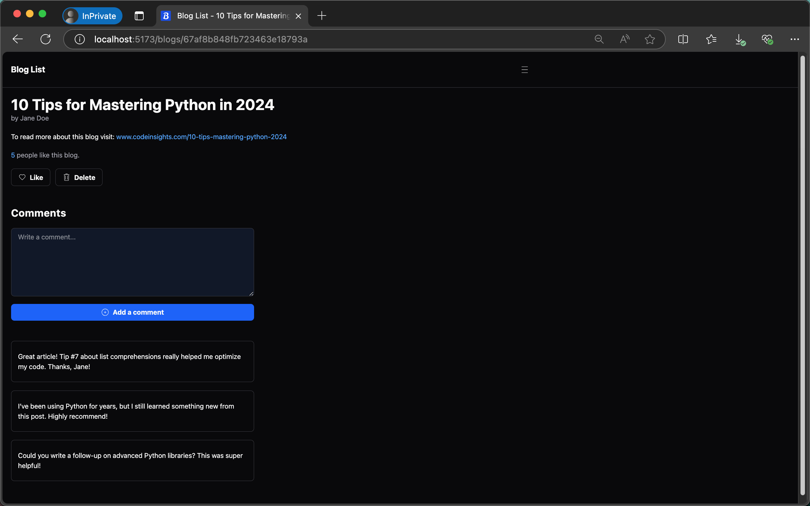
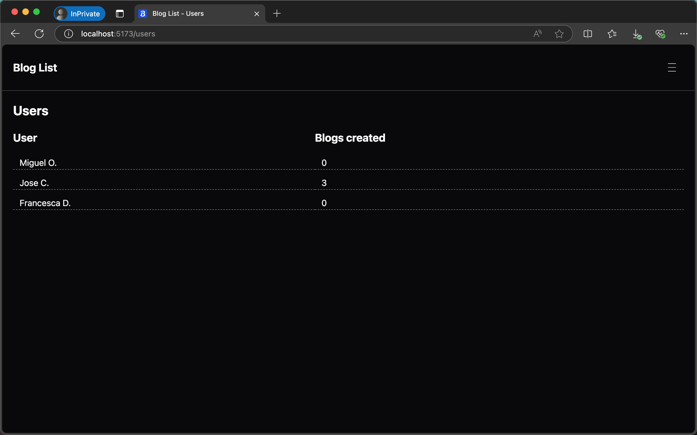
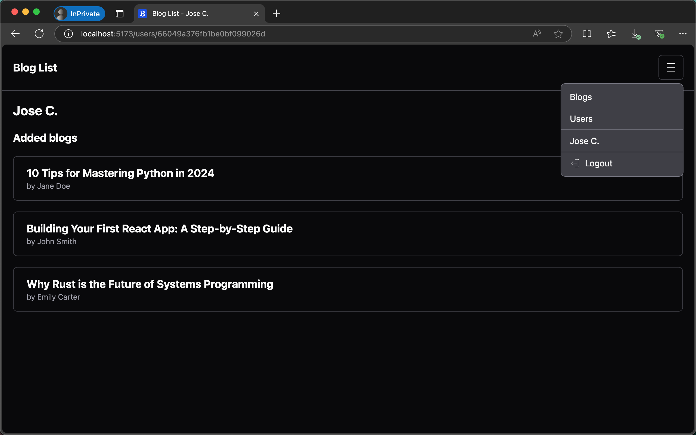

# Blog List Application

This repository contains the full-stack **Blog List** application developed as part of the **Full Stack Open** course offered by the University of Helsinki. The application consists of three main components:

1. **Blog List Frontend**: A React-based frontend for managing blogs, users, and authentication.
2. **Blog List Backend**: A Node.js and Express backend that provides a RESTful API for the frontend.
3. **Blog List End-to-End Tests**: Cypress-based end-to-end tests for the application.

The project is organized into three folders: `blog-client`, `blog-server`, and `blog-tests`.

## Table of Contents

- [Blog List Frontend](#blog-list-frontend)

  - [Features](#features)
  - [Technologies Used](#technologies-used)
  - [Installation](#installation)
  - [State Management](#state-management)
  - [Routing](#routing)
  - [Testing](#testing)
  - [Gallery](#gallery)

- [Blog List Backend](#blog-list-backend)

  - [Features](#features-1)
  - [Technologies Used](#technologies-used-1)
  - [Installation](#installation-1)
  - [API Endpoints](#api-endpoints)
  - [Testing](#testing-1)

- [Blog List End-to-End Tests](#blog-list-end-to-end-tests)

  - [Features](#features-2)
  - [Technologies Used](#technologies-used-2)
  - [Installation](#installation-2)
  - [Test Scenarios](#test-scenarios)

## Blog List Frontend

This is the frontend part of the Blog List application. It is built using **React**, **Redux**, and **React Router**, and it interacts with the backend API to manage blogs, users, and authentication.

### Features

- **User Authentication**: Users can log in, log out, and stay authenticated across sessions.
- **Blog Management**: Users can create, view, like, and delete blogs.
- **Commenting**: Users can add comments to blogs.
- **User Profiles**: View user profiles and see the blogs they have created.
- **Responsive Design**: Built with **Tailwind CSS** for a responsive and modern UI.

### Technologies Used

- **React**: A JavaScript library for building user interfaces.
- **Redux**: A state management library for managing global state.
- **React Router**: For handling client-side routing.
- **Tailwind CSS**: A utility-first CSS framework for styling.
- **Axios**: For making HTTP requests to the backend API.
- **Vite**: A fast build tool for modern web development.
- **Vitest**: A testing framework for unit and integration tests.

### Installation

1. **Clone the repository**:

   ```bash
   git clone https://github.com/josemigueli/fso-part7.git
   cd fso-part7/blog/blog-client
   ```

2. **Install dependencies**:

   ```bash
   npm install
   ```

3. **Start the development server**:

   ```bash
   npm run dev
   ```

4. **Open the application**:
   The application will be running at `http://localhost:5173`.

### State Management

The application uses **Redux** for state management. The following reducers are defined:

- **`blogReducer`**: Manages the state of blogs, including fetching, creating, liking, and deleting blogs.
- **`loginReducer`**: Manages user authentication state.
- **`notificationReducer`**: Manages notifications displayed to the user.
- **`usersReducer`**: Manages the state of users and their blogs.

### Routing

The application uses **React Router** for client-side routing. The following routes are defined:

- **`/`**: Home page displaying a list of blogs.
- **`/login`**: Login page for user authentication.
- **`/blogs/:id`**: Displays detailed information about a specific blog.
- **`/users`**: Displays a list of users.
- **`/users/:id`**: Displays detailed information about a specific user.

### Testing

The project includes tests written with **Vitest** and **React Testing Library**. To run the tests, use the following command:

```bash
npm run test
```

### Gallery

#### Login



#### Home



#### New Blog



#### Blog



#### Users



#### User



## Blog List Backend

This is the backend part of the Blog List application. It is built using **Node.js**, **Express**, and **MongoDB**, and it provides a RESTful API for managing blogs, users, comments, and authentication.

### Features

- **User Authentication**: Users can log in and receive a JSON Web Token (JWT) for authenticated requests.
- **Blog Management**: Users can create, read, update, and delete blogs.
- **Commenting**: Users can add comments to blogs.
- **User Management**: Users can be created and retrieved, and their associated blogs can be viewed.
- **Testing**: Includes a testing endpoint to reset the database for testing purposes.

### Technologies Used

- **Node.js**: A JavaScript runtime for building server-side applications.
- **Express**: A web framework for Node.js.
- **MongoDB**: A NoSQL database for storing application data.
- **Mongoose**: An ODM (Object Data Modeling) library for MongoDB.
- **JSON Web Tokens (JWT)**: For user authentication and authorization.
- **Bcrypt**: For hashing user passwords.
- **CORS**: Middleware for enabling Cross-Origin Resource Sharing.
- **Dotenv**: For managing environment variables.

### Installation

1. **Clone the repository**:

   ```bash
   git clone https://github.com/josemigueli/fso-part7.git
   cd fso-part7/blog/blog-server
   ```

2. **Install dependencies**:

   ```bash
   npm install
   ```

3. **Set up environment variables**:
   Create a `.env` file in the root directory and add the following variables:

   ```
   MONGODB_URI=your-mongodb-uri
   TEST_MONGODB_URI=your-mongodb-uri-for-tests
   PORT=your-port
   SECRET=your-secret-key

   ```

4. **Start the development server**:

   ```bash
   npm run dev
   ```

5. **Access the API**:
   The API will be running at `http://localhost:3001`.

### API Endpoints

#### Authentication

- **POST /api/login**: Authenticates a user and returns a JWT.

#### Users

- **GET /api/users**: Retrieves a list of all users with their associated blogs.
- **POST /api/users**: Creates a new user.

#### Blogs

- **GET /api/blogs**: Retrieves a list of all blogs.
- **POST /api/blogs**: Creates a new blog (requires JWT).
- **PUT /api/blogs/:id**: Updates a blog (requires JWT).
- **DELETE /api/blogs/:id**: Deletes a blog (requires JWT).

#### Comments

- **GET /api/comments**: Retrieves a list of all comments.
- **POST /api/comments**: Adds a comment to a blog.

#### Testing

- **POST /api/testing/reset**: Resets the database by deleting all blogs and users (for testing purposes).

### Testing

The project includes a testing endpoint to reset the database, which is useful for integration testing. To reset the database, send a POST request to `/api/testing/reset`.

To put the backend in test mode you need to run

```bash
npm run start:test
```

Make sure you've added the MongoDB URI for tests.

## Blog List End-to-End Tests

This repository contains end-to-end (E2E) tests for the **Blog List** application, written using **Cypress**.

### Features

- **Login Tests**: Tests for successful and failed login attempts.
- **Blog Management Tests**: Tests for creating, liking, and deleting blogs.
- **User-Specific Tests**: Ensures that only the creator of a blog can delete it.
- **Sorting Tests**: Verifies that blogs are ordered by the number of likes.

### Technologies Used

- **Cypress**: A JavaScript-based end-to-end testing framework.
- **Node.js**: The runtime environment for running the tests.
- **Express**: The backend server used for the application.

### Installation

1. **Clone the repository**:

   ```bash
   git clone https://github.com/josemigueli/fso-part7.git
   cd fso-part7/blog/blog-tests
   ```

2. **Install dependencies**:

   ```bash
   npm install
   ```

3. **Start the frontend and backend servers**:
   Ensure that both the frontend and backend servers are running. The frontend should be running at `http://localhost:5173`, and the backend at `http://localhost:3001`.

4. **Run the tests**:
   ```bash
   npm run cypress:open
   ```

### Test Scenarios

#### Login Tests

- **Login form is shown**: Verifies that the login form is displayed correctly.
- **Login with correct credentials**: Tests successful login and verifies that the user menu is displayed.
- **Login with wrong credentials**: Tests failed login and verifies that an error message is displayed.

#### Blog Management Tests

- **A blog can be created**: Tests the creation of a new blog and verifies that it appears in the list.
- **User can like a blog**: Tests the like functionality and verifies that the like count is updated.
- **User who created a blog can delete it**: Tests the deletion of a blog and verifies that it is removed from the list.

#### User-Specific Tests

- **Only the creator can see the delete button of a blog**: Ensures that the delete button is only visible to the creator of the blog.

#### Sorting Tests

- **Blogs are ordered by likes**: Verifies that blogs are sorted by the number of likes in descending order.

## License

This project is licensed under the MIT License.
