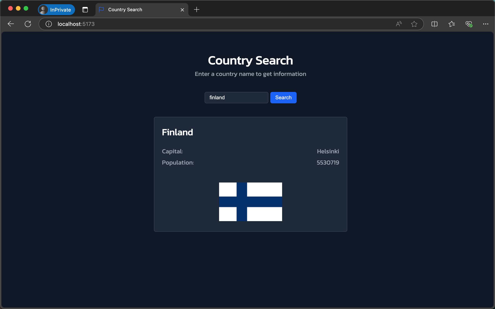

# Country Hook Application

This project is part of the **Full Stack Open** course by the University of Helsinki, specifically from Part 7, which focuses on React applications with custom hooks. The project demonstrates how to use custom hooks in React by creating an application that fetches and displays information about countries based on user input.

## Features

- **Custom Hooks**: Implements `useField` and `useCountry` hooks for managing input state and fetching country data.
- **REST API Integration**: Fetches country data from the [REST Countries API](https://studies.cs.helsinki.fi/restcountries/api/name/).
- **Dynamic Rendering**: Displays country information dynamically, including its name, capital, population, and flag.
- **Error Handling**: Gracefully handles cases where the entered country is not found.

## Prerequisites

To run this project, ensure you have the following installed:

- [Node.js](https://nodejs.org/) (v16 or later)
- [npm](https://www.npmjs.com/) or [yarn](https://yarnpkg.com/)

## Installation

1. Clone the repository:

   ```bash
   git clone https://github.com/josemigueli/fso-part7.git
   ```

2. Navigate to the project directory:

   ```bash
   cd fso-part7/country-hook
   ```

3. Install the dependencies:

   ```bash
   npm install
   ```

## Scripts

- **Development Server**:

  ```bash
  npm run dev
  ```

  This will start the development server using Vite. The application will be available at `http://localhost:5173` by default.

- **Build for Production**:

  ```bash
  npm run build
  ```

  This will create an optimized production build in the `dist` directory.

## Custom Hooks

### `useField`

A custom hook for managing the state of input fields.

```javascript
export const useField = (type) => {
  const [value, setValue] = useState('')

  const onChange = (event) => {
    setValue(event.target.value)
  }

  return {
    type,
    value,
    onChange,
  }
}
```

### `useCountry`

A custom hook for fetching country data from the REST Countries API.

```javascript
export const useCountry = (name) => {
  const [country, setCountry] = useState(null)

  useEffect(() => {
    if (name) {
      const baseUrl = 'https://studies.cs.helsinki.fi/restcountries/api/name/'
      axios
        .get(`${baseUrl}/${name}`)
        .then((res) => {
          setCountry({
            found: true,
            data: {
              name: res.data.name.common,
              capital: res.data.capital[0],
              population: res.data.population,
              flag: res.data.flags.png,
            },
          })
        })
        .catch(() => {
          setCountry({
            found: false,
            data: null,
          })
        })
    }
  }, [name])

  return country
}
```

## Usage

1. Start the development server:

   ```bash
   npm run dev
   ```

2. Open the application in your browser at `http://localhost:5173`.

3. Enter a country name in the input field and click **Search**. If the country is found, information including its name, capital, population, and flag will be displayed. If not, a "Not found" message will appear.

## Dependencies

- [React](https://reactjs.org/)
- [Axios](https://axios-http.com/)
- [Vite](https://vitejs.dev/)

## Gallery

### Home View



## License

This project is licensed under the MIT License. You are free to use, modify, and distribute it as per the license terms.

---

This application is part of the **Full Stack Open** course, designed to teach modern web development practices using React and custom hooks.
