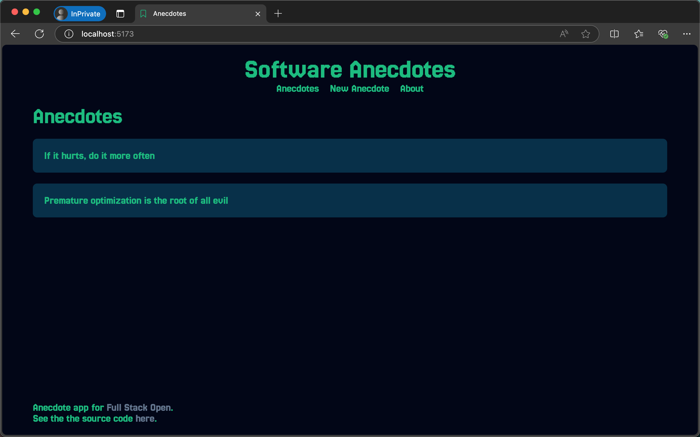
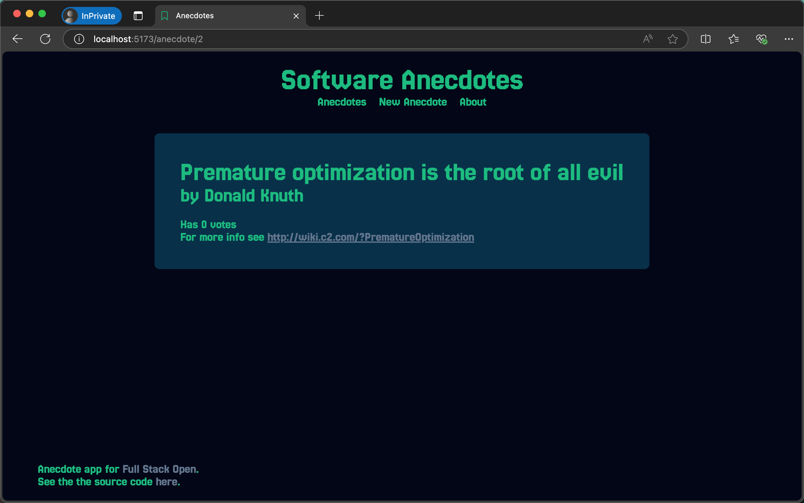
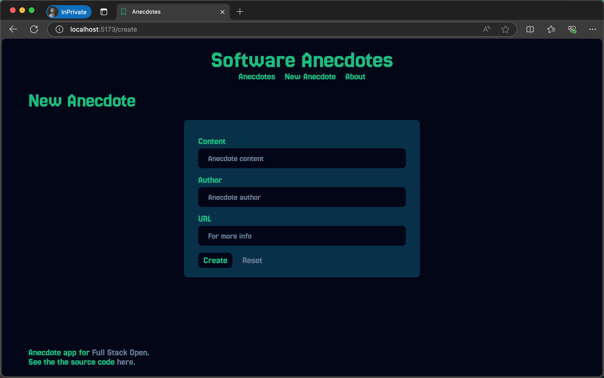
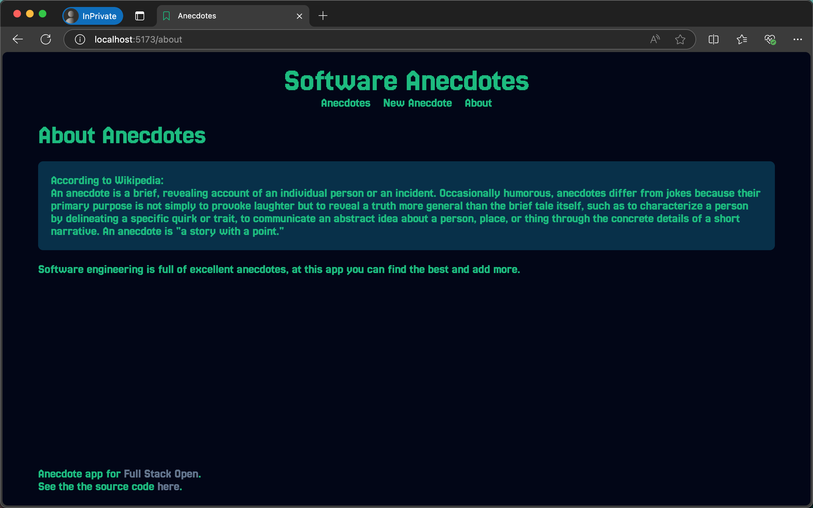

# Routed Anecdotes

This project is part of the [Full Stack Open](https://fullstackopen.com/) course by the University of Helsinki. The application was developed as exercise of Part 7 and focuses on the use of React Router and custom hooks to manage state and routing in a React application.

## Description

Routed Anecdotes is a simple web application that allows users to view, create, and explore anecdotes related to software engineering. The app leverages React Router for navigation between different pages and demonstrates the use of custom hooks for form input handling.

### Features

- View a list of existing anecdotes.
- View detailed information about a single anecdote.
- Create new anecdotes with a form that uses a custom `useField` hook.
- Navigate between the main menu, the "New Anecdote" page, and the "About" page using React Router.
- Notifications are displayed when new anecdotes are added.

## Technologies Used

- React
- React Router
- Vite
- Custom hooks

## Setup Instructions

### Prerequisites

- Node.js (>=14)
- npm or yarn

### Installation

1. Clone the repository:

   ```bash
   git clone https://github.com/josemigueli/fso-part7.git
   cd fso-part7/routed-anecdotes
   ```

2. Install dependencies:

   ```bash
   npm install
   # or
   yarn install
   ```

3. Run the development server:

   ```bash
   npm run dev
   # or
   yarn dev
   ```

   The application will be available at `http://localhost:5173`.

4. To build the application for production:

   ```bash
   npm run build
   # or
   yarn build
   ```

   The built files will be located in the `dist` directory.

5. To preview the production build locally:

   ```bash
   npm run preview
   # or
   yarn preview
   ```

## Key Components

### App

The main component of the application. It defines the routes using React Router and contains the navigation menu and footer.

### Menu

A navigation bar with links to "Anecdotes," "New Anecdote," and "About."

### AnecdoteList

Displays a list of anecdotes, with links to view each anecdote's details.

### Anecdote

Displays detailed information about a single anecdote, including its content, author, votes, and a link for more information.

### CreateNew

A form that allows users to create new anecdotes. The form fields are managed using the custom `useField` hook.

### About

A page providing information about anecdotes and their significance in software engineering.

### Footer

A footer with references to the Full Stack Open course and the source code.

### Custom Hook: `useField`

This hook simplifies form input management by providing properties and functions for managing input values and resets.

## Gallery

### Home View



### Anecdote View



### Create View



### About View



## License

This project is developed as part of the Full Stack Open course and follows its licensing terms.
