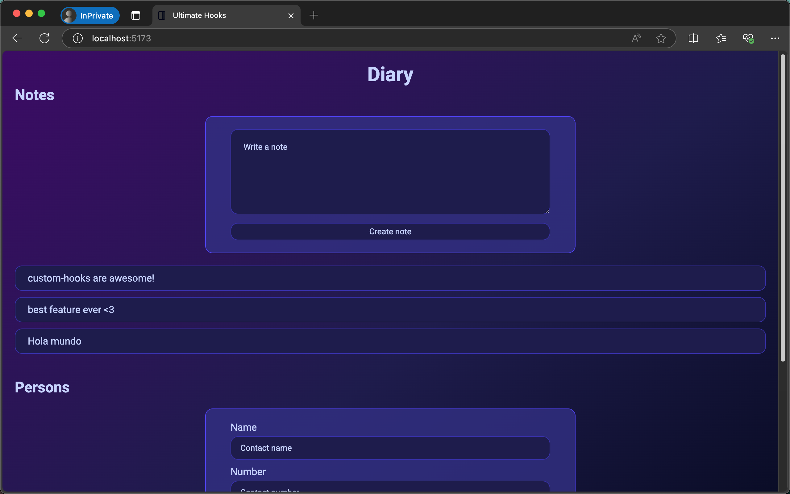

# Ultimate Hooks

This project is part of **Part 7** of the [Full Stack Open course](https://fullstackopen.com/en/) by the University of Helsinki. It demonstrates the use of custom React hooks to manage form inputs and interact with external APIs.

## Features

- **Custom Hooks**:

  - `useField`: A hook to manage form input state, including reset functionality.
  - `useResource`: A hook to manage resources fetched and updated from a REST API.

- **JSON Server**:

  - Simulates a REST API for managing notes and persons.
  - Provides endpoints to create, read, and update resources.

- **Interactive UI**:
  - Add notes to a diary.
  - Manage contact information, including names and phone numbers.

## Getting Started

### Prerequisites

Make sure you have the following installed on your system:

- Node.js (v18 or higher recommended)
- npm or yarn

### Installation

1. Clone the repository and navigate to the project directory.

    ```bash
    git clone https://github.com/josemigueli/fso-part7.git

    cd fso-part7/ultimate-hooks
    ```

2. Install the dependencies:

   ```bash
   npm install
   ```

3. Start the JSON server:

   ```bash
   npm run server
   ```

   The server will run on `http://localhost:3005` by default.

4. Start the development server:

   ```bash
   npm run dev
   ```

   The application will open in your default browser at `http://localhost:5173`.

### Building for Production

To build the application for production, run:

```bash
npm run build
```

The output files will be located in the `dist` folder.

### Preview Production Build

To preview the production build locally:

```bash
npm run preview
```

## Scripts

- **`dev`**: Starts the development server using Vite.
- **`build`**: Builds the application for production.
- **`lint`**: Runs ESLint to check for code quality issues.
- **`server`**: Starts the JSON server on port 3005.
- **`preview`**: Serves the production build locally.

## Project Highlights

### Custom Hooks

#### `useField`

Manages form inputs with the following features:

- Tracks `value` and `onChange` events.
- Provides a `reset` function to clear the input field.

Example usage:

```jsx
const [content, resetContent] = useField('text')
<input {...content} />
<button onClick={resetContent}>Reset</button>
```

#### `useResource`

Handles fetching and creating resources from a given base URL.

- Fetches resources on mount.
- Provides a `create` function to add new resources.

Example usage:

```jsx
const [notes, noteService] = useResource('http://localhost:3005/notes')
noteService.create({ content: 'New note' })
```

### JSON Server

- The server data is stored in `db.json`.
- Endpoints:
  - `GET /notes`
  - `POST /notes`
  - `GET /persons`
  - `POST /persons`

## Gallery

### Notes View



### Persons View


## Learn More

To learn more about React custom hooks, visit the [React documentation](https://react.dev/learn/reusing-logic-with-custom-hooks).

For more about JSON Server, check the [official documentation](https://github.com/typicode/json-server).

## License

This project is licensed under the [MIT License](https://opensource.org/licenses/MIT).
